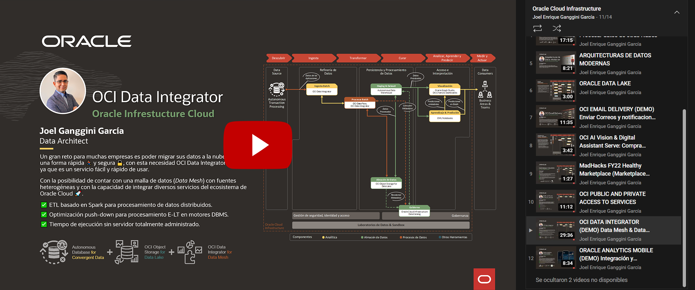

[![Issues][issues-shield]][issues-url]
[![LinkedIn][linkedin-shield]][linkedin-url]


<!-- PROJECT LOGO -->
<br />
<p align="center">
  

  <h3 align="center">OCI Data Integrator</h3>

  <p align="center">
    Migración de Datos desde Oracle On-Premise a Autonomous Database
    <br />
    <a href="#"><strong>Explore the code »</strong></a>
    <br />
    <br />
    <a href="https://youtu.be/eAVyD-uxt6U">🎬 View Demo</a>
    ·
    <a href="https://github.com/jganggini/oci/issues">Report Bug</a>
    ·
    <a href="https://github.com/jganggini/oci/issues">Request Feature</a>
  </p>
</p>


<!-- TABLE OF CONTENTS -->
<details open="open">
  <summary>Contenido</summary>
  <ol>
    <li><a href="#proyecto">Proyecto</a></li>
    <li>
        <a href="#descripción">Descripción</a>
        <ul>
            <li><a href="#parameters">Parameters</a></li>
        </ul>
    </li>
    <li><a href="#contacto">Contacto</a></li>
  </ol>
</details>

<!-- Proyecto -->
## Proyecto

Se requiere poder integrar datos de diferentes esquemas dentro de una misma base de datos de forma dinámica, adicional a ello se requiere contar con una estructura paramétrica.

Se recomienda hacer uso de Autonomous Database para poder procesar y encontrar un balance entre el consumo de recursos del procesamiento del motor de base de datos y poder generar un Pipeline en OCI Data Integrator.

Los administradores, los ingenieros de datos, los desarrolladores de ETL y los operadores se encuentran entre los diferentes tipos de profesionales de datos que utilizan OCI Data Integrator.

El siguiente diagrama ilustra el pipeline en OCI Data Integrator:

<p align="center">
    
</p>

<!-- Parameters -->
## Parameters

*   `PASO 01` — [01-CORE/01-data-layer.sql](01-CORE/01-data-layer.sql) — Parametros para la creación de capas para el tratamiento de datos.

    ```sql
    DECLARE
      -- Parameter
      par_data_layer          VARCHAR2(30)    := 'STAGING';
      par_schema_name         VARCHAR2(30)    := 'STG1';
      par_schema_password     VARCHAR2(15)    := 'fLkq,756z5{i1';
      par_shema_drop          BOOLEAN         := FALSE;
      -- Variables
      var_query               VARCHAR2(32767) := NULL;
    BEGIN
    ```

    ```sql
    DECLARE
      -- Parameter
      par_data_layer          VARCHAR2(30)    := 'STAGING';
      par_schema_name         VARCHAR2(30)    := 'STG2';
      par_schema_password     VARCHAR2(15)    := 'fLkq,756z5{i2';
      par_shema_drop          BOOLEAN         := FALSE;
      -- Variables
      var_query               VARCHAR2(32767) := NULL;
    BEGIN
    ```

    ```sql
    DECLARE
      -- Parameter
      par_data_layer          VARCHAR2(30)    := 'STAGING';
      par_schema_name         VARCHAR2(30)    := 'STG3';
      par_schema_password     VARCHAR2(15)    := 'fLkq,756z5{i3';
      par_shema_drop          BOOLEAN         := FALSE;
      -- Variables
      var_query               VARCHAR2(32767) := NULL;
    BEGIN
    ```
    
    ```sql
    DECLARE
      -- Parameter
      par_data_layer          VARCHAR2(30)    := 'MAPPING';
      par_schema_name         VARCHAR2(30)    := 'MAP';
      par_schema_password     VARCHAR2(15)    := 'zU4Z+*n{uI[x';
      par_shema_drop          BOOLEAN         := FALSE;
      -- Variables
      var_query               VARCHAR2(32767) := NULL;
    BEGIN
    ```

    ```sql
    DECLARE
      -- Parameter
      par_data_layer          VARCHAR2(30)    := 'UTILITY';
      par_schema_name         VARCHAR2(30)    := 'UTL';
      par_schema_password     VARCHAR2(15)    := 'zU4Z+*n{uI[x';
      par_shema_drop          BOOLEAN         := FALSE;
      -- Variables
      var_query               VARCHAR2(32767) := NULL;
    BEGIN
    ```

    ```sql
    DECLARE
      -- Parameter
      par_data_layer          VARCHAR2(30)    := 'DATASET';
      par_schema_name         VARCHAR2(30)    := 'DTS';
      par_schema_password     VARCHAR2(15)    := 'zU4Z+*n{uI[x';
      par_shema_drop          BOOLEAN         := FALSE;
      -- Variables
      var_query               VARCHAR2(32767) := NULL;
    BEGIN
    ```

*   `PASO 02` — [01-CORE/02-dbms_cloud.sql](01-CORE/02-dbms_cloud.sql) — Credenciales para conectarnos a un Bucket en OCI desde Autnomous Database.
    
    ```sql
    DECLARE
      -- ParameterDATA-LAYER
      par_data_layer          VARCHAR2(30)    := 'STAGING';
      par_schema_name         VARCHAR2(30)    := 'STG';
      -- Parameter: OCI >> Identity >> Users >> User Details >> Auth Tokens
      par_credential_name     VARCHAR2(30)    := 'OBJ_STORE_CRED';
      par_username            VARCHAR2(100)   := 'oracleidentitycloudservice/joel.ganggini@oracle.com';
      par_password            VARCHAR2(100)   := 'a:sdMVACop{7oVd]JZM5';
      par_drop_credential     BOOLEAN         := FALSE;
      -- Variables
      var_query               VARCHAR2(32767) := NULL;
    BEGIN
    ```
    
    ```sql
    DECLARE
      -- Parameter: DATA-LAYER
      par_data_layer          VARCHAR2(30)    := 'DATASET';
      par_schema_name         VARCHAR2(30)    := 'DTS';
      -- Parameter: OCI >> Identity >> Users >> User Details >> Auth Tokens
      par_credential_name     VARCHAR2(30)    := 'OBJ_STORE_CRED';
      par_username            VARCHAR2(100)   := 'oracleidentitycloudservice/joel.ganggini@oracle.com';
      par_password            VARCHAR2(100)   := 'a:sdMVACop{7oVd]JZM5';
      par_drop_credential     BOOLEAN         := FALSE;
      -- Variables
      var_query               VARCHAR2(32767) := NULL;
    BEGIN
    ```

*   `PASO 03` — [02-STAGING/01-table-source.persons_demo.sql](02-STAGING/01-table-source.persons_demo.sql) — Datos de de prueba generado por intervalos.

    1. DROP_TABLE: Eliminar tabla si existe.
    2. CREATE_TABLE: Crear tabla.
    3. INSERT_TABLE: Insertar datos de prueba.

*   `PASO 04` — [03-UTILITY/101-table-utility-parameter.sql](02-UTILITY/101 table-utility-parameter.sql) — Datos de de prueba generado por intervalos.

    1. DROP_TABLE: Eliminar tabla si existe.
    2. DROP_SEQ: Eliminar sequiencia si existe.
    3. CREATE_SEQ: Crear sequencia.
    4. CREATE_TABLE: Crear tabla.
    5. CREATE_TRIGGER: Crear trigger.
    6. INSERT_TABLE: Insertar Parametros.

*   `PASO 05` — [03-UTILITY/102-procedure-utility-parameter.sql](02-UTILITY/102-procedure-utility-parameter.sql) — Remplazo de variables dentro de una consulta PL/SQL.

*   `PASO 06` — [03-UTILITY/201-procedure-utility-data-join.sql](02-UTILITY/201-procedure-utility-data-join.sql) — Union de tablas de forma dinamica con una misma estructura en diferentes esquemas.

*   `DATA FRAMEWORK`: Para mayor detalle

    <p align="left">
      <a href="https://youtu.be/eAVyD-uxt6U">
        
      </a>
    </p>
 
<!-- Contacto -->
## Contacto

Joel Ganggini García - [@jganggini](https://www.linkedin.com/in/jganggini/) - jganggini@gmail.com

Project Link: [https://github.com/jganggini/oci](https://github.com/jganggini/oci)