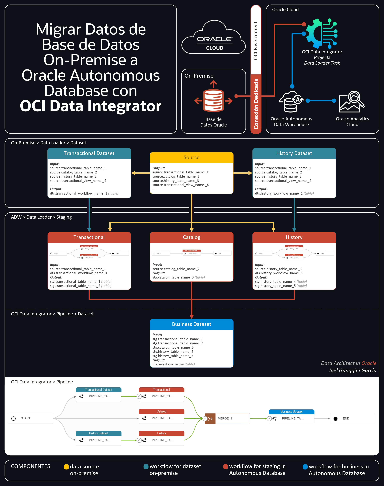
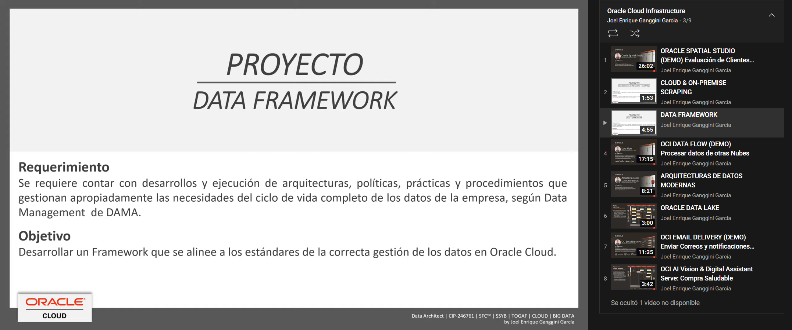

[![Issues][issues-shield]][issues-url]
[![LinkedIn][linkedin-shield]][linkedin-url]


<!-- PROJECT LOGO -->
<br />
<p align="center">
  

  <h3 align="center">OCI Data Integrator</h3>

  <p align="center">
    Migración de Datos desde Oracle On-Premise a Autnomous Database
    <br />
    <a href="#"><strong>Explore the code »</strong></a>
    <br />
    <br />
    <a href="https://lnkd.in/e9n6iRAR">🎬 View Demo</a>
    ·
    <a href="https://github.com/jganggini/oci/issues">Report Bug</a>
    ·
    <a href="https://github.com/jganggini/oci/issues">Request Feature</a>
  </p>
</p>


<!-- TABLE OF CONTENTS -->
<details open="open">
  <summary>Contenido</summary>
  <ol>
    <li><a href="#proyecto">Proyecto</a></li>
    <li>
        <a href="#descripción">Descripción</a>
        <ul>
            <li><a href="#parameters">Parameters</a></li>
        </ul>
    </li>
    <li><a href="#contacto">Contacto</a></li>
  </ol>
</details>

<!-- Proyecto -->
## Proyecto

Un gran reto para muchas empresas es poder migrar sus datos a la nube de una forma rápida y segura, con esta necesidad OCI Data Integrator es clave ya que es un servicio fácil y rápido de usar.

El siguiente flujo es un ejemplo que refleja la necesidad de procesas datos en una Base de Datos On-Premise (preparar los datos) antes de ser migrados ya que hay lógica de negocio que no se puede replicar como otras tablas o vistas que si se migrarían con cargas incrementales.

Los administradores, los ingenieros de datos, los desarrolladores de ETL y los operadores se encuentran entre los diferentes tipos de profesionales de datos que utilizan Oracle Cloud Infrastructure Data Integration.

El siguiente diagrama ilustra esta arquitectura de referencia:

<p align="center">
    
</p>

<!-- Parameters -->
## Parameters

*   `data-layer.sql`: Parametros para la creación de Capas para el tratamiento de datos.
    ```sql
    DECLARE
        -- Parameter
        par_data_layer          VARCHAR2(30)    := 'DATASET';
        par_schema_name         VARCHAR2(30)    := 'OBI_UTILITY';
        par_schema_password     VARCHAR2(15)    := 'zU4Z+*n{uI[x';
        par_shema_drop          BOOLEAN         := TRUE;
        -- Variables
        var_query               VARCHAR2(32767) := NULL;
    BEGIN
    ```

*   `DATA FRAMEWORK`: Para mayor detalle

    <p align="left">
      <a href="https://youtu.be/KtZ0Nuiz4zA">
        
      </a>
    </p>
 
<!-- Contacto -->
## Contacto

Joel Ganggini García - [@jganggini](https://www.linkedin.com/in/jganggini/) - jganggini@gmail.com

Project Link: [https://github.com/jganggini/oci](https://github.com/jganggini/oci)

<!-- MARKDOWN LINKS & IMAGES -->
<!-- https://www.markdownguide.org/basic-syntax/#reference-style-links -->
[issues-shield]: https://img.shields.io/github/issues/othneildrew/Best-README-Template.svg?style=for-the-badge
[issues-url]: https://github.com/jganggini/oci/issues
[linkedin-shield]: https://img.shields.io/badge/-LinkedIn-black.svg?style=for-the-badge&logo=linkedin&colorB=555
[linkedin-url]: https://www.linkedin.com/in/jganggini/